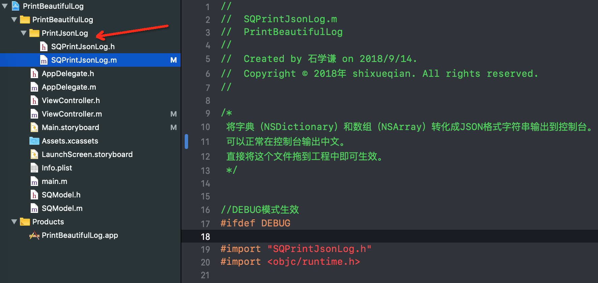

# PrintBeautifulLog

### 作用
将字典(NSDictionary)和数组(NSArray)打印的Log显示为Json格式,可以解决Xcode打印字典和数组时中文显示乱码问题。
* 完美解决字典和数组调试打印时中文显示乱码问题
* 使用JSON格式打印，可以通过JSON格式化验证
* 缩进格式显示，层次清晰
* 使用po命令调试时也能生效
* DEBUG模式生效，不影响线上版本
* 兼容iOS8及以上版本（iOS8以下没有测试过）

比如打印以下这个字典：
```
- (IBAction)printDict:(id)sender {
NSDictionary *dict = @{
                       @"ArticleTitle":@"【iOS开发】打开另一个APP（URL Scheme与openURL）",
                       @"ArticleUrl":@"https://www.jianshu.com/p/0811ccd6a65d",
                       @"author":@{
                               @"nickName":@"谦言忘语",
                               @"blog":@"https://www.jianshu.com/u/cc2cf725ac0c",
                               @"work":@"iOS工程师"
                               }
                       };
NSLog(@"打印出的字典：%@",dict);
}
```

使用之前打印的结果：
```
2018-09-04 11:09:53.413 PrintBeautifulLog[4362:372485] 打印出的字典：{
    ArticleTitle = "\U3010iOS\U5f00\U53d1\U3011\U6253\U5f00\U53e6\U4e00\U4e2aAPP\Uff08URL Scheme\U4e0eopenURL\Uff09";
    ArticleUrl = "https://www.jianshu.com/p/0811ccd6a65d";
    author =     {
        blog = "https://www.jianshu.com/u/cc2cf725ac0c";
        nickName = "\U8c26\U8a00\U5fd8\U8bed";
        work = "iOS\U5de5\U7a0b\U5e08";
    };
}
```
使用之后打印的结果：
```
2018-09-04 11:10:39.559 PrintBeautifulLog[4403:375253] 打印出的字典：{
  "ArticleTitle" : "【iOS开发】打开另一个APP（URL Scheme与openURL）",
  "ArticleUrl" : "https:\/\/www.jianshu.com\/p\/0811ccd6a65d",
  "author" : {
    "work" : "iOS工程师",
    "blog" : "https:\/\/www.jianshu.com\/u\/cc2cf725ac0c",
    "nickName" : "谦言忘语"
  }
}
```

### 使用方式
直接将 SQPrintJsonLog.m 拉入到工程中即可自动生效使用。



### 原理
请查看我的简书上的一篇文章[【iOS】让NSLog打印字典显示得更好看(解决中文乱码并显示成JSON格式)](https://www.jianshu.com/p/79cd2476287d)

### 觉得有用的话，不如点下star？
